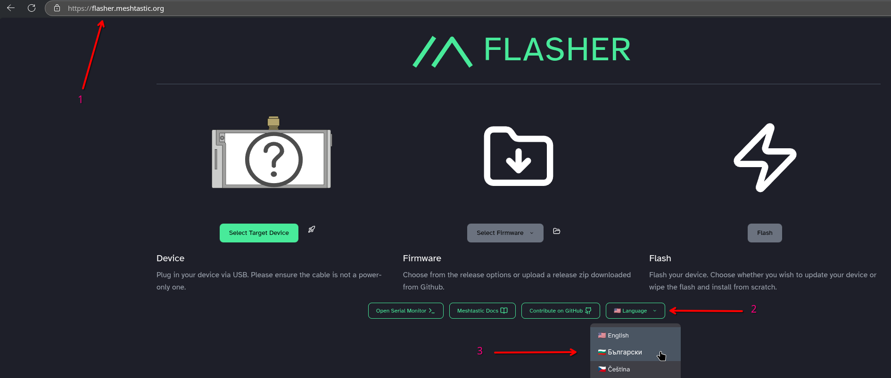
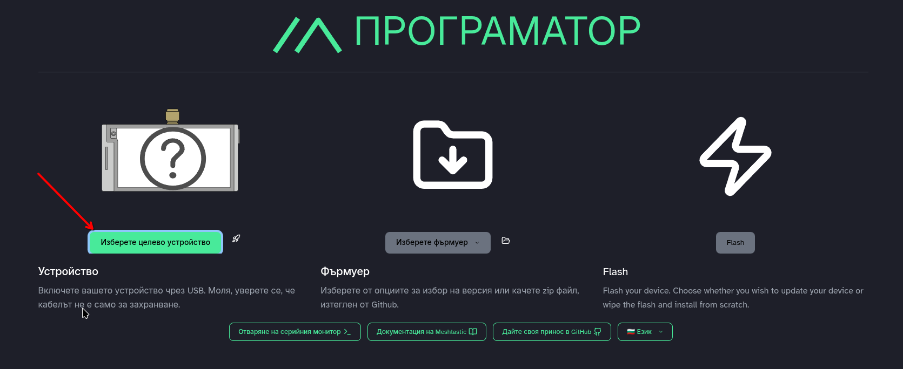
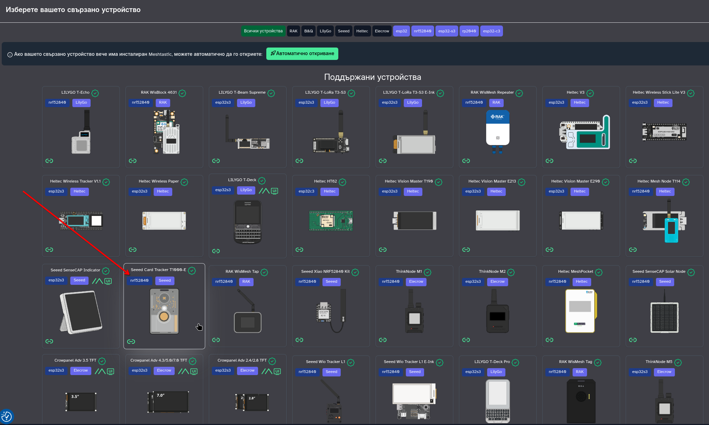
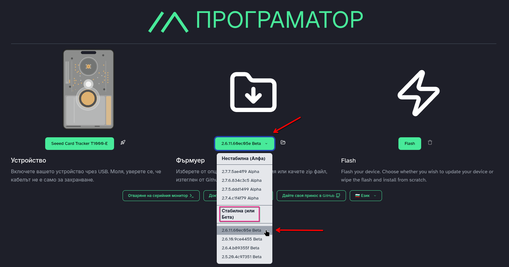
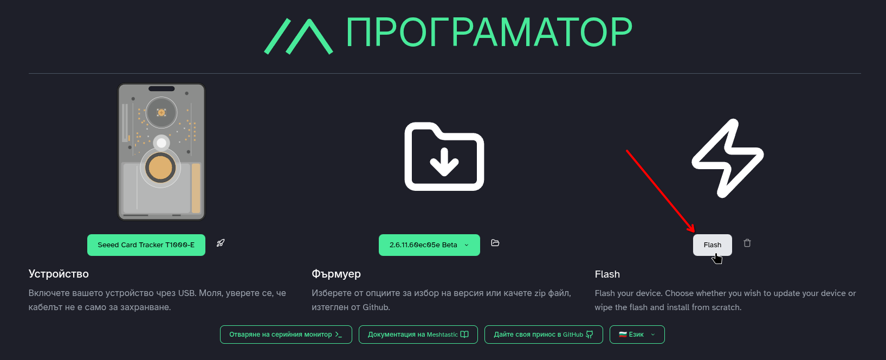
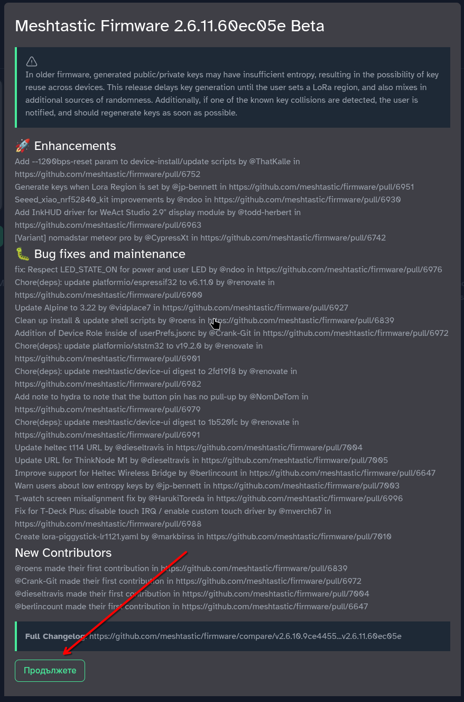
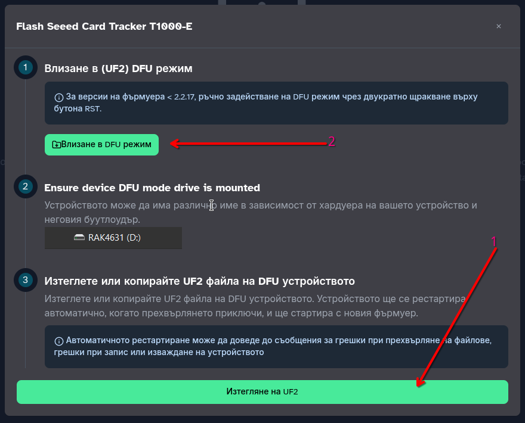
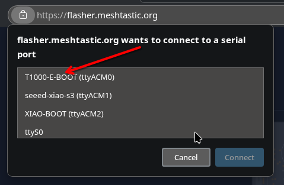
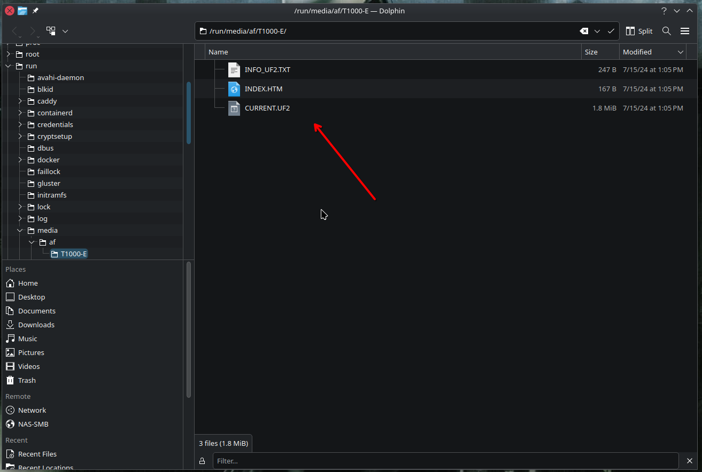

# T1000-E Firmware

## Стъпки за флашване на последния фърмуер от Мештастик

1. Свържете устройството с магнитния кабел към компютъра.
    - Първо свържете кабела към компютъра, а после магнитния край за връзка към тракера.
    - Трябва да чуете звук от устройството и да мига зеленият светодиод.

2. Отворете Google Chrome или Microsoft Edge (не работи с Firefox)
    - отворете адрес: [https://flasher.meshtastic.org](https://flasher.meshtastic.org)
    - от менюто за език изберете "Български"

    

3. Натиснете бутона за избор на устройство

    

4. Изберете правилното устройство (в този случай T1000-E)

    

5. Ако желаете, изберете различен фърмуер от последния стабилен. За предпочитане е да оставите вече избрания от системата фърмуер и да прескочите тази стъпка. Системата е избрала последната версия на стабилен фърмуер за вас.

    

6. Натиснете бутона за програмиране

    

7. След показване на информация за фърмуера, приемете и продължете напред.

    

8. На следващия екран първо изтеглете UF2 файла – това е фърмуерът. След това влезте в DFU режим.

    

9. За да вкарате устройството в DFU режим, трябва да изберете правилния сериен порт. Ако имате няколко устройства закачени към компютъра, ще виждате всички. Трябва да изберете правилното устройство.

    

10. Ако всичко е успешно, трябва да видите ново флаш устройство (нещо като външен хард диск или "флашка") закачено към компютъра ви. Ако виждате външното устройство, преминете към следващата стъпка, ако не – прочетете тази точка до края.

    Ако не се е появило ново дисково устройство, значи процедурата през браузъра, която трябва да рестартира тракера в режим DFU, не е сработила.
    Това, което трябва да направите сега, е да задържите бутона на тракера, след което леко да побутнете магнитният кабел с пръст, до толкова, че да го изключите, но без да го премахвате. Това трябва да го направите два пъти бързо. Т.е. трябва два пъти да се откачи и да се закачи кабела към устройството бързо докато държите бутона наитснат.

    **ВАЖНО!** Ако нещо се обърка или не можете да върнете устройството към живот - 1. изключете кабела, 2. задръжте бутона, 3. включте кабела.

11. Тъй като работя с Linux и нямам Windows или OSX, а подозирам, че почти никой от четящите не е на Linux, се извинявам, че няма как да ви предоставя снимка от тотално погрешния ви избор на операционна система, ама това си е ваш проблем. Адаптирайте си информацията както намерите за добре, спрямо вашата OS. Ето как изглежда при мен новото прикачено устройство, тип външна памет.

    

12. В тази папка (на външното устройство) копирате изтегления фърмуер, след което устройството ще се рестартира само.

13. С това трябва да приключи обновяването на фърмуера.
