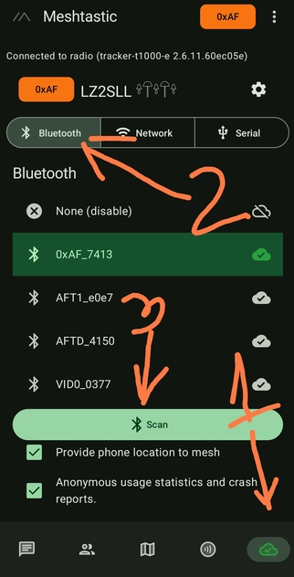
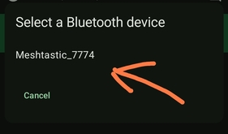
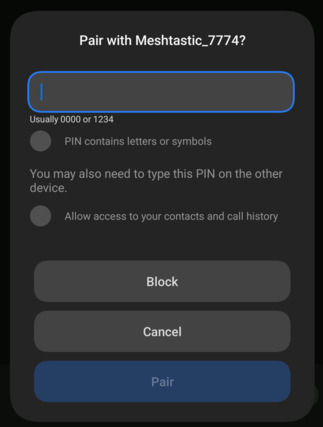
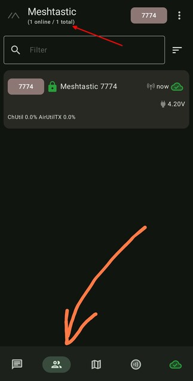

# 3.01. Връзка към устройството

## Стъпки за свързване с устройството през андроид. Адаптирайте инструкциите за IOS или [WEB клиента (не реботи във Firefox)](https://client.meshtastic.org).

- Пуснете устройството, ако не е пуснато вече, като натиснете бутона еднократно.

- Изтеглете приоложението [Meshtastic](https://play.google.com/store/apps/details?id=com.geeksville.mesh) за андроид.

- Стартирайте приложението и сканирайте за Bluetooth устройства, за да се свържете с тракера.

    

- Свързване с устройството през Bluetooth

    

- Трябва да въведете PIN кода, който е **123456**. Ако устройството ви има екран, то вероятно на него е изписан генериран PIN код, който да ползвате

    

- Ако всичко е успешно, след няколко секунди трябва да се озовете в екрана, който показва активните нодове. За момента трябва да е само вашият нод, понеже още няма настроен пресет за комуникация.

    
