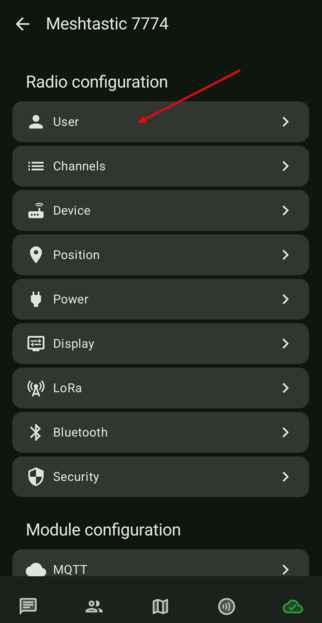
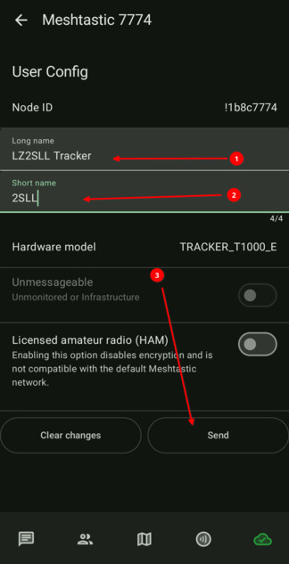

# 3.04. Смяна на името

### Желателно е да смените името на устройството си, за да сте разпознаваеми в мрежата. Важно е да имаме адекватни имена за кратно и дълго име. Краткото име е 4 символа, докато дългото може да е 40 символа. Аз лично попълвам нещо значещо за мен лично в краткото име, но за дългото име попълвам "LZ2SLL нещо си", тъй като съм радиолюбител и инициала ми ме идентифицира лесно.

-  Влизаме в настройките на нода и избираме секция USER, за да попълним кратко и дълго име.

    

-  Сменяме имената

    
