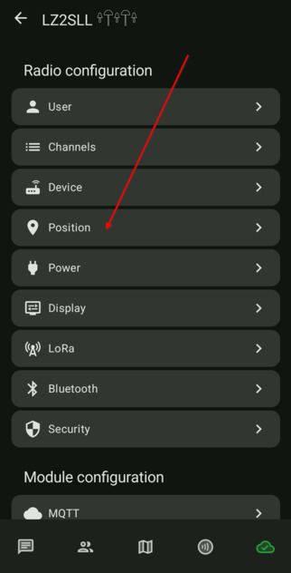
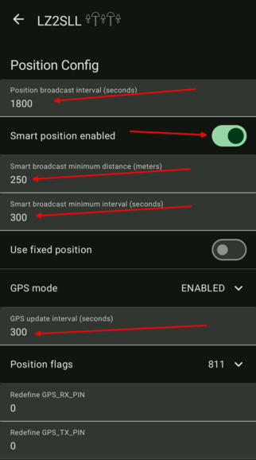

# 3.06. Локация и GPS

### Ако ползвате устройство с GPS (напр. тракер) на батерия, е желателно да ограничите рапортите за локация в ефира, както и свалянето на данни от GPS модула. Аз настройвам устройствата така:

-  Влизаме в настройките на нода и избираме секция *Position*.

    

- Променяме настройките по следния начин

    
