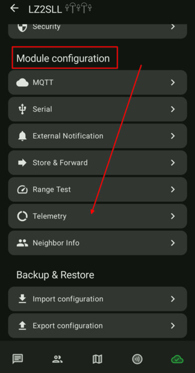
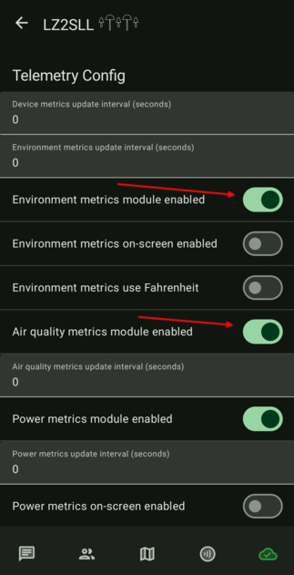
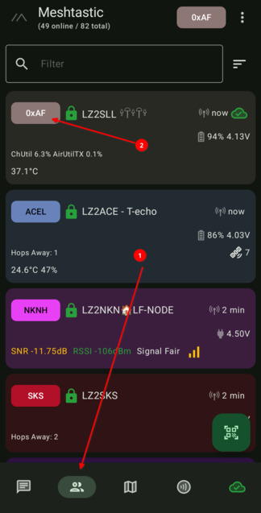
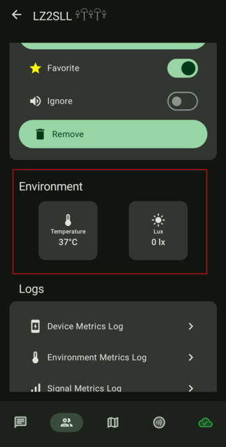

# 3.09. Телеметрия

## Тези настройки са за T1000-E тракерите

### T1000-E тракерите имат вградени сензори за температура и осветеност, които може да включите и да се репортват в мрежата.

-  Влизаме в настройките на нода и в секция "Module Configuration" избираме "Telemetry"

    

- Променяме настройките по следният начин:
    - Environment metrics module enabled: `ON`
    - Air quality metrics module enabled: `ON`

    

- След рестартиране на устройството, би трябвало да можем да видим актуални данни за нода си
  
    
    
