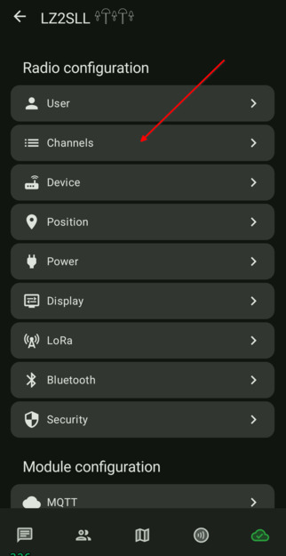
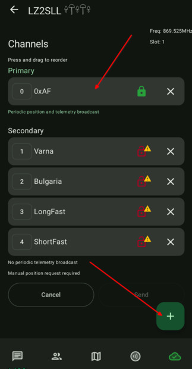
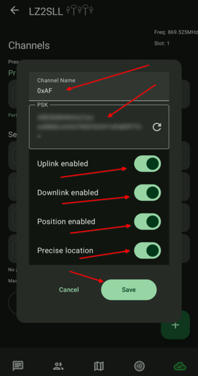
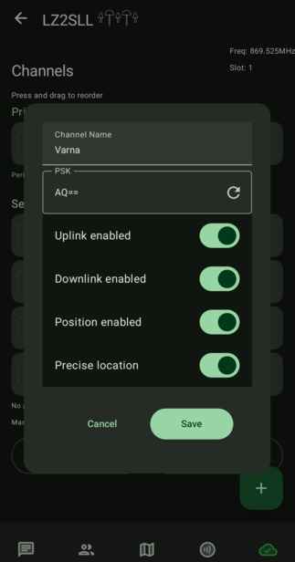
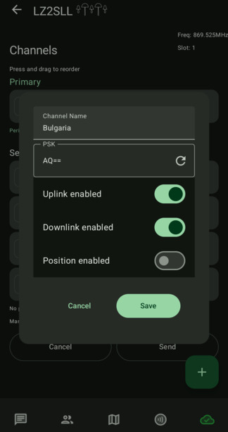
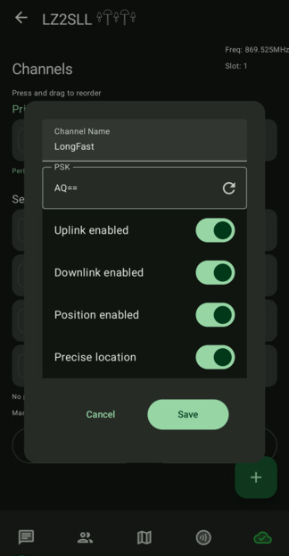
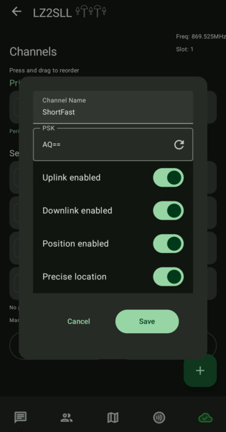

# 3.10. Канали

### Трябва да имате предвид, че телеметриите ви вървят само в нулевия/главния/primary канал. Желателно е да си настроите PRIMARY канала като личен ваш канал с ваш ключ.

-  Влизаме в настройките на нода в секция "Channels"

    

- Променяме настройките на нулевия (PRIMARY) канал, а след това добавяме още канали.

    

-  За PRIMARY канала си избираме име и използваме генерираният ключ, ако нямаме вече генериран от друго устройство. Всички устройства трябва да имат един и същи ключ за канала, за да могат да говорят по между си. Ако желаете този канал да минава и през MQTT брокера, трябва да включите Uplink и Downlink. Ако желаете да споделяте локацията си в този канал, може да включите и съответните настройки.
  
    

- За SECONDARY каналите, аз си добавям "`Varna`", "`Bulgaria`", "`LongFast`" и "`ShortFast`". Това са публични канали и ключът за тях трябва да бъде "`AQ==`". (Буквите `A`, `Q` и два знака за равенство `=`).  
Канал "`Bulgaria`" комуникира през MQTT брокера само и там не искам да си споделям локацията, а последните два канала ги добавям, за да мога да комуникирам с всички, които са в канала по подразбиране за съответния модем пресет. Тъй като и аз превключвам пресет-а от време на време между LongFast и ShortFast.  
На всички канали позволявам на брокера да пренася съобщенията.

    
    
    
    
