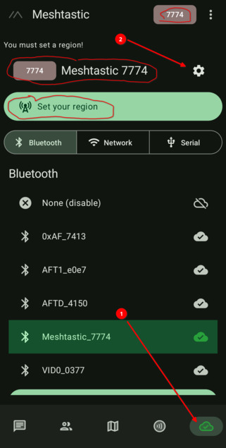
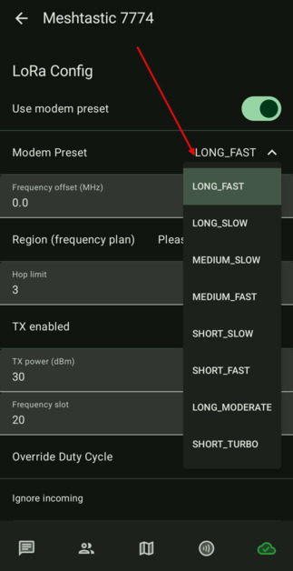
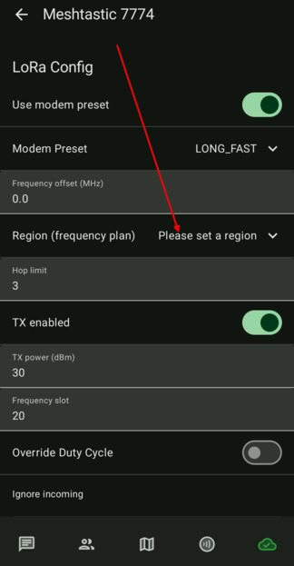
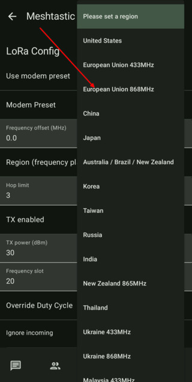
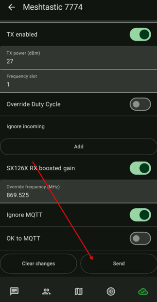
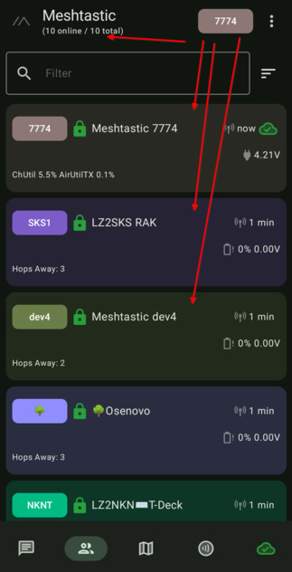

# 3.2. Радио настройки

- След като натиснете таб-а за връзки, долу вдясно (1), обърнете внимание на заградените полета в снимката. Вашият нод (ако го настройвате за пръв път) иска да зададете региона, в който се намирате. Трябва да сте сигурни, че управлявате правилният нод. След това може да продължите към следващата стъпка и да натиснете бутона за настройки (2).

    

- Ако сте натиснали бутона за регион в предната стъпка, може да пропуснете тази стъпка. Ако сте натиснали бутона за настойките, то трябва да виждате следният екран, чрез който ще стигнете до LoRa настройките.

    

- Първото нещо, което трябва да насторим е модем пресет-а. В момента на писане на тази информация, все още ползваме пресет LONG_FAST. Но след 1ви Октомври 2025, всички нодове ще преминат (трябва да преминат) на SHORT_FAST. Ако четете това след въпросната дата, моля да настроите на SHORT_FAST.

    

- Следва да изберем регионът.

    

- Тук задължително избирате "Europen Union 868Mhz" (EU_868)

    

- Записваме настройките, най-долу в екрана. Устройството ще се рестартира и след кратко време телефонът ви ще се свърже отново с него.

    

- След като се свържат отново, вече трябва да виждате налични нодове.
Ако се забави, може да изберете "NONE" за свързано устройство, а след секунда да изберете пак вашето устройство. Това ще накара приложението да се закачи отново към устройството ви, без да чакате.
Може да отнеме малко време преди да видите активни нодове, в зависиомост къде се намирате и колко нодове се чуват в ефира. Повечето нодове си съобщават идентификацията на всеки 3 часа, така, че не бързайте.

    
