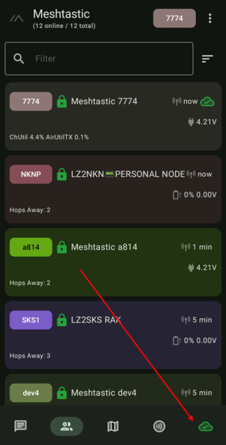
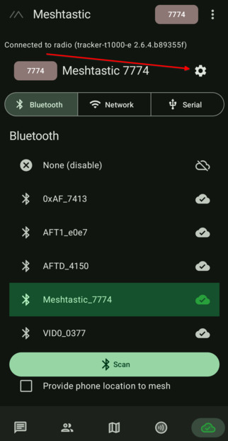
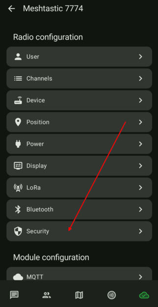
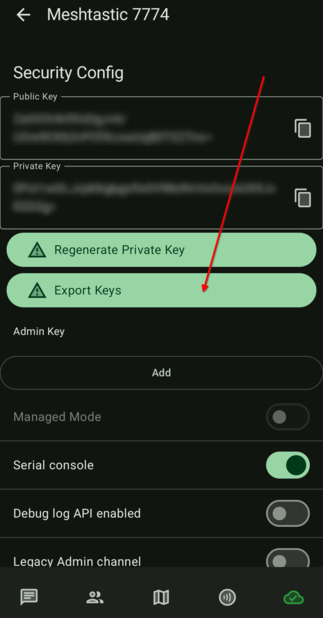

# 3.3. Запазване на ключовете

### Запазването на ключовете е много важно. Ако поради някаква причина се наложи да регенерирате ключовете си, останалите нодове, които вече ви познават с вашия предишен публичен ключ няма да могат да комуникират с вас, докато не изтрият от базата си вашият нод. Това значи, че всички, които вече са чули нода ви в ефир, трябва да извършат ръчно изтриване на нода ви, за да могат да получат новия ви ключ, за да комуникират с вас отново.

- Отиваме в настойките, като натиснем най-дясната иконка в долния край на екрана. Това е стъпка 1 за да стигнем до настройките.

    

-  От тук натискаме зъбното колело за настройки. Това е стъпка 2. Запомнете тази рутина (стъпка едно и две), понеже ще ви трябва често.

    

-  Задължително нещо, което трябва да направим е да запазим личния и публичния ключ на устройството. **Това е много важна стъпка, не я пропускайте**. За целта, отиваме в *Security* настройките.

    

-  Тук трябва да запазите ключовете си. Не ви трябва да променяте нищо друго в тази секция.

    
