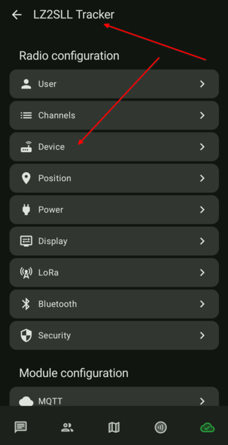
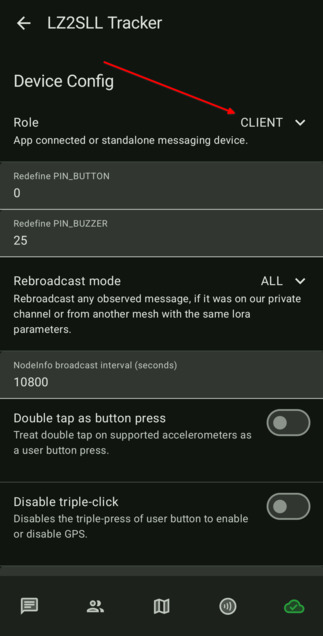
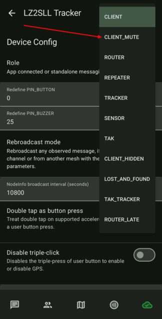
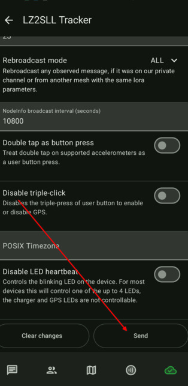

# 3.5. Настройка на ролята

### Ролята на устройството ни е много важна настройка. Ето кратка информация за ролите, а [тук](https://meshtastic.org/blog/choosing-the-right-device-role/) ще намерите по-подробна информация.

| Роля            | Препращане на съобщения | Видим в списъка с нодове | Консумация на енергия | BLE/WiFi/Serial | Препоръчва се за                               |
| --------------- | :---------------------: | :----------------------: | :-------------------: | :-------------: | ---------------------------------------------- |
| CLIENT          |  Да (при необходимост)  |            Да            |       Нормална        |       Да        | Обща употреба (предимно за стационарни нодове) |
| **CLIENT_MUTE** |           Не            |            Да            |         Ниска         |       Да        | В градски условия или мрежа с много устройства. **Ако ползвате MQTT брокер, задължително сложете тази роля!** |
| CLIENT_HIDDEN   |      Само локални       |          **Не**          |         Ниска         |       Да        | Невидим нод, пестене на енергия                |
| TRACKER         |    Само ако е буден     |            Да            |    Нормална/ниска     |       Да        | Следене и локация                              |
| LOST_AND_FOUND  |           Да            |            Да            |       Нормална        |       Да        | За издирване на устройство                     |
| SENSOR          |    Само ако е буден     |            Да            |    Нормална/ниска     |       Да        | Наблюдение на околна среда                     |
| ROUTER          |           Да            |            Да            |        Висока         |       Да        | Инфраструктурен нод за разширяване на мрежата  |
| ROUTER_LATE     |           Да            |            Да            |        Висока         |       Да        | Покриване на мъртви точки                      |
| REPEATER        |           Да            |          **Не**          |        Висока         |       Да        | Невидим Рутер                                  |

-  Отваряме настройките и избираме *Device*.

    

-  Тук трябва да сменим ролята на нашето устройство.

    

-  Ако настройвате тракер, т.е. преносимо устройство, най-добрата роля за това устройство е CLIENT_MUTE. Така ще избегнем допълнителните усложнения и излишното натоварване на мрежата. Това са преносими нодове и трябва да са в тих режим.

    

-  Запазваме настройките

    
