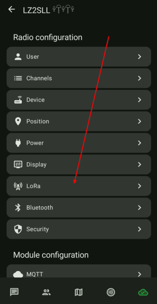
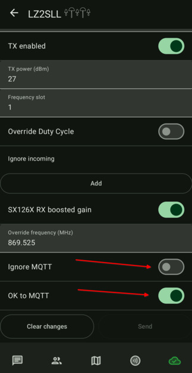
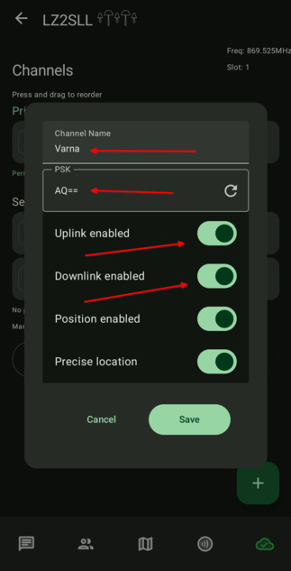
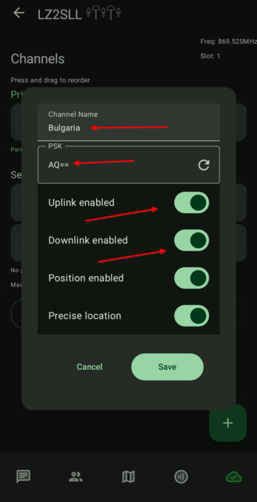

# 3.7. MQTT Брокер

### С MQTT брокер устройството ви ще може да комуникира през интернет с други нодове, които не са в зоната на радио ефирно покритие. С тази настройка (и наличен интернет) ще можете да достигнете варненския ефир дори и да не сте в града. Също така ще имате възможност да комуникирате с останалите нодове в цяла България, чрез канал Bulgaria. Но нека не забравяме каква е концепцията на Мештастик мрежата. Тя не трябва да разчита на интернет.

## **ВАЖНО!** Ако възнамерявате да ползвате MQTT брокера и канал #Bulgaria, задължително си сменете ролята на устройството на CLIENT_MUTE. В противен случай, устройството ви ще хвърля всички съобщения от канал #Bulgaria в ефира. Това ще доведе до претоварване на мрежата!

-  Влизаме в настройките на нода и в секция "Module Configuration" избираме "MQTT"

    

- Променяме настройките по следният начин:
    - MQTT Enabled: `ON`
    - Address: `mqtt.varna.radio`
    - Username: `meshdev`
    - Password: `large4cats`
    - Topic: `msh/Bulgaria`
    - Proxy to client: `ON` (Тази настройка трябва да е изключена, ако нода ви има WiFi свързаност и сте си настроили WiFi мрежата.)

    

- След записа на тези настройки и рестартирането на устройството, трябва да промените още две настройки в LoRa радио

    

- А именно:
    - Ignore MQTT: `OFF`
    - OK to MQTT: `ON`

    

- След това, трябва да позволите на каналите си да комуникират през брокера.  
    **ВАЖНО!** Ако добавите канал `Bulgaria`, променете ролята на устройството си на `CLIENT_MUTE`.

    
    
    
  