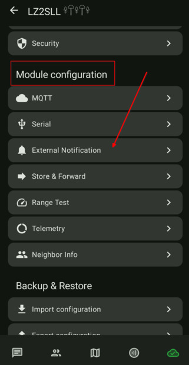
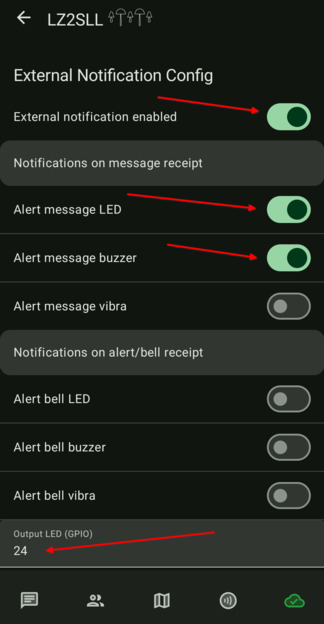
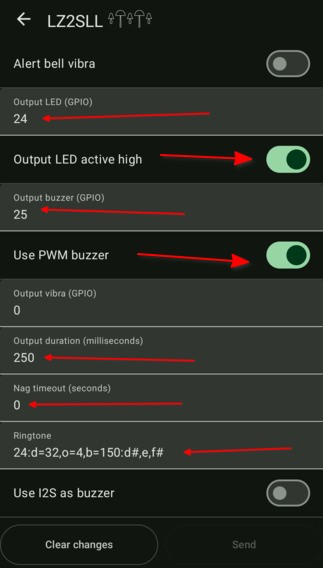

# 3.8. Нотификации - звук и светлина

## Тези настройки са за T1000-E тракерите

### T1000-E тракерите имат buzzer и LED. Началните настройки са изключително досадни. Като получите съобщение, ще ви пищи в продължение на 1 минута или докато не натиснете бутона. За това ви предлагам други настройки за нотификациите.

-  Влизаме в настройките на нода и в секция "Module Configuration" избираме "External Notification"

    

- Променяме настройките по следният начин:
    - External Notification Enabled: `ON`
    - Alert message LED: `ON`
    - Alert message buzzer: `ON`
    - Output LED (GPIO): `24`
    - Output LED active high: `ON`
    - Output buzzer (GPIO): `25`
    - Use PWM buzzer: `ON`
    - Output duration: `250` (колко милисекунди да свири еднократен сигнал)
    - Nag timeout: `0` (колко секунди да повтаря еднократния сигнал, при 0 ще го повтори само веднъж)
    - Ringtone: `24:d=32,0=4,b=150:d#,e,f#` (това е мелодията на самият сигнал, за повече информация [тук](https://mtnme.sh/guides/ringtones/) и [тук](https://eddmann.com/nokia-composer-web/))

    
    
